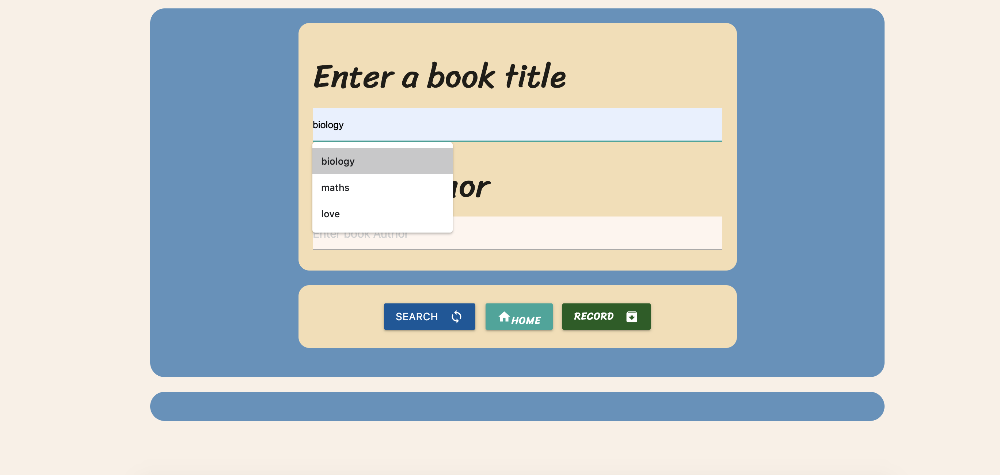
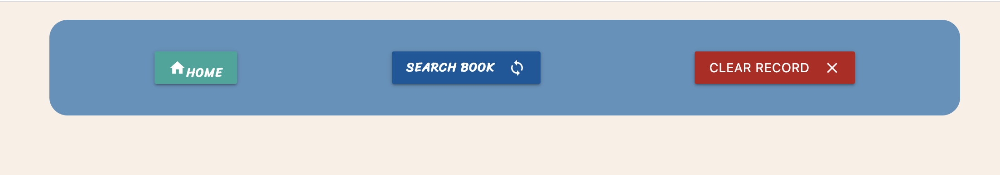

# Book Market

Book Market  is a quick and convenient platform to source a book or to learn more about the works of an author.

# The application has the following features:

1. Users are able to search a vast database of book titles and authors. 

2. Users receive ratings from the Google Books and GoodReads online book review forums and a plot summary.

3. Provides a reliable purchase link for the chosen book once the buy button is clicked

4. Stores the user's previously searched titles and authors

# To develop the project, the following processes were implemented:

1. jQuery was used to develop the basic functionality of the application

2. The Google books API was used to generate search results for the user's author/title search, the rating of a given title, a description of the plot, and an image of the cover
3. The Good Reads API was used to generate a purchase link for a given title
4. Materialize and Bootstrap were used for styling
5. Dayjs was utilized to log the date of the search
6. Font awesome was utilized for styling all fonts

#link to the functional url
https://marimartin.github.io/project-1/index.html
